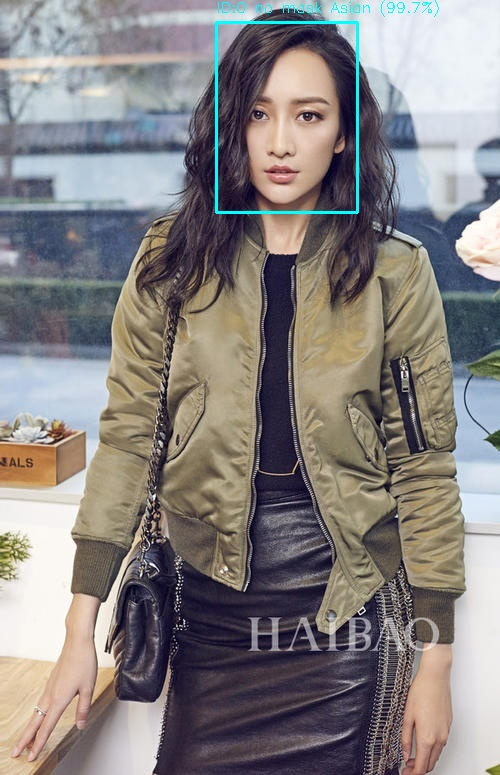

# YOLO-MFR: A Multi-Facial Recognition System Based on YOLOv5

中文名：基于 YOLOv5 的人脸检测与属性识别系统

本项目结合 YOLOv5 和自定义分类器实现对图像/视频/摄像头中的人脸检测、人脸 ID 标识、是否佩戴口罩及人种识别等多种功能，实时推理及结果保存。

经过验证，口罩识别准确率可达90%+，人种识别准确率可达98%+


## ✨ 项目功能

- ✅ 人脸检测（YOLOv5）
- ✅ 人脸 ID 标注与追踪
- ✅ 口罩识别（戴/不戴）
- ✅ 人种识别（自定义分类器）
- ✅ 支持图片、视频、摄像头三种输入模式
- ✅ 处理结果可保存为新图像或新视频

## 📂 项目结构
```
YOLO-MFR/
├──example/                         # 示例图片
├──results/                         # 检测与分类后的结果图片输出目录
├──best.pt                          # 训练好的 YOLOv5 权重文件（人脸+口罩识别）
├──detect_and_classify.py           # 主程序：人脸检测 + 口罩识别 + 人种分类的推理脚本
├──race_classifier.py               # 轻量版人种分类模型的加载与推理模块
├──race_classifier_full.pth         # 完整人种分类模型的 PyTorch 权重文件
├──README.md                        # 项目说明文档   
└──requirements.txt                 # 依赖包
```

## 🛠️ 环境配置
### 安装PyTorch
安装教程可参考B站视频 附[视频链接](https://www.bilibili.com/video/BV1Kdr8YGE2X?vd_source=a1f65e6f22bbb222adf31539dcfc1a33)
,作者讲的非常详细，是个很好的教程

建议 PyTorch 版本：`torch==2.3.1`，需支持 GPU (CUDA)。

原视频来自 UP 主 [@大家好我叫王大顺](https://space.bilibili.com/1571828623?spm_id_from=333.788.upinfo.head.click)，已公开分享，本文仅引用其链接，若有侵权请联系删除。
### 创建虚拟环境
#推荐使用Anaconda Promt
若无Anaconda，可点击[下载地址](www.anaconda.com/download/success)前往官网下载（选择Miniconda即可）
```bash
conda create -n yolomfr python=3.9         #创建虚拟环境
conda activate yolomfr                     #激活虚拟环境
pip install -r requirements.txt            #下载依赖包
```
### 安装YOLOv5库
可以直接前往GitHub官网搜索YOLOv5下载 附[库地址](https://github.com/ultralytics/yolov5.git)

也可直接在虚拟环境中进行克隆
```bash
git clone https://github.com/ultralytics/yolov5.git
cd yolov5
pip install -r requirements.txt
```
注意：本项目中不包含YOLOv5 ，请用户自行克隆并安装。


## 🚀 使用说明
Pycharm或其他编程软件
将项目从软件打开后，选择你创建的虚拟环境作为python解释器，然后进入detect_and_classify.py文件，点击运行，运行结果如下


用户选择对应数字进入对应操作,若选择处理图片和视频，处理好后将会保存至results文件夹

## 📺 演示结果
| 原始图像 | 检测结果 |
|----------|----------|
| 示例1 | 示例2 |
|  |  |
|  |  |


## 📁 模型文件使用说明

- `best.pt`：YOLOv5 训练的口罩+人脸检测模型
- `race_classifier_full.pth`：轻量化 CNN 实现的人种识别模型

将两者放置于根目录即可，无需修改代码路径。
## ⚠️ 注意事项

- 本项目不包含 YOLOv5，请用户自行克隆。
- 如果运行摄像头时报错，请检查是否被其他程序占用。
- 视频处理时输出可能较慢，需等待全部帧处理完成。

## 📜 License

本项目仅用于学习与研究目的

## 🙏 致谢

 [Ultralytics YOLOv5](https://github.com/ultralytics/yolov5)